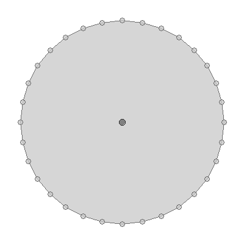

buffer
======

**Name**:

geom buffer

**Description**:

Buffer a geometry by a distance.

**Arguments**:

   * -d --distance: The buffer distance

   * -q --quadrantSegments: The number of quadrant segments

   * -c --endCapStyle: The end cap style (round, flat/butt, square)

   * -s --singleSided: The flag for whether the buffer should be single sided

   * -g --geometry: The input geometry

   * --help : Print help message

**Example**::

    geom buffer -g "POINT (1 1)" -d 10

