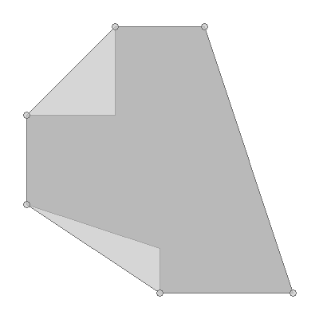

convexHull
==========

**Name**:

geom convexHull

**Description**:

Calculate the convex hull of a Geometry.

**Arguments**:

   * -g --geometry: The input geometry

   * --help : Print help message

**Example**::

    geom convexhull -g "POLYGON ((9 52, 9 50, 7 50, 7 48, 10 47, 10 46, 13 46, 11 52, 10 52, 9 52))"

