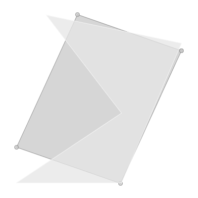

minrect
=======

**Name**:

geom minrect

**Description**:

Calculate the minimum rectangle of the input geometry.

**Arguments**:

   * -g --geometry: The input geometry

   * --help : Print help message

**Example**::

    geom minrect -g "POLYGON ((16 51, 7 53, 12 46, 5 41, 12 41, 16 51))"

