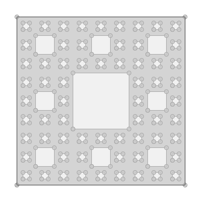

sierpinskicarpet
================

**Name**:

geom sierpinskicarpet

**Description**:

Create a sierpinski carpet.

**Arguments**:

   * -n --number: The number of points.

   * -g --geometry: The input geometry

   * --help : Print help message

   * --web-help : Open help in a web browser

**Example**::

    geom sierpinskicarpet -g "POLYGON ((0 0, 0 10, 10 10, 10 0, 0 0))" -n 100

