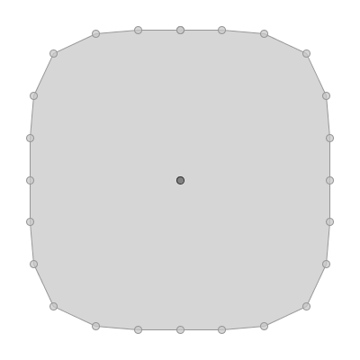

supercircle
===========

**Name**:

geom supercircle

**Description**:

Create a super circle.

**Arguments**:

   * -o --power: The positive power

   * -w --width: The width

   * -h --height: The height

   * -p --numberOfPoints: The number of points

   * -r --rotation: The rotation

   * -c --center: The flag to use center (true) or the base (false)

   * -g --geometry: The input geometry

   * --help : Print help message

   * --web-help : Open help in a web browser

**Example**::

    geom supercircle -g "POINT (100 100)" -p 30 -w 500 -h 500

